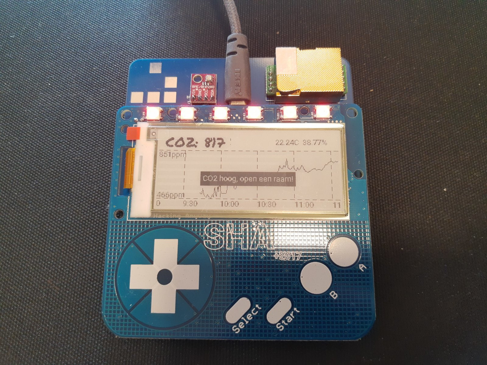

SHA2017 Badge CO2 Sensor
========================

**NOTE: This app has been replaced by esphome and is thus unmaintained**

MicroPython program for reading an MH-Z19 carbon dioxide sensor. The values are
displayed on the badge's display as a single stat and graph, pushed to MQTT and
used as a trigger for alerts.

Also reads a BME280 climate sensor as a bonus.

The CO2 warning thresholds are set to levels suitable to reduce the risk of
Coronavirus infections.

The MQTT topics are listed below, the value is the raw decimal number without
unit. The prefix and (room) name can be altered by setting them with the
`machine.nvs_setstr` functions over a serial connection.

* `${mqtt.prefix}/${name}/co2_ppm`
* `${mqtt.prefix}/${name}/temperature_c`
* `${mqtt.prefix}/${name}/pressure_hpa`
* `${mqtt.prefix}/${name}/humidity_pct`

NVS settings:

| Space     | Key           | Default                   |
|-----------|---------------|---------------------------|
| `owner`   | `name`        | `<whatever you have set>` |
| `sensors` | `mqtt.server` | `test.mosquitto.org`      |
| `sensors` | `mqtt.prefix` | `space/climate`           |

This app is published on the SHA Badge repository, install
`sha2017_badge_co2_sensor` to get it. You may also want to set the NVS setting
`system`/`default_app` to launch it on powerup.
